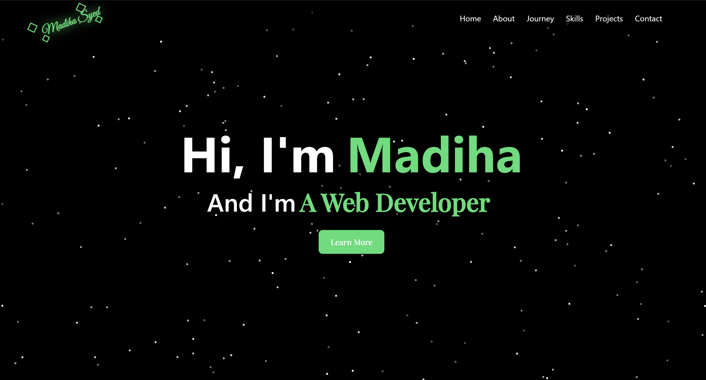

# 🌐 Madiha Syed – Developer Portfolio

Welcome to my personal **portfolio website** repository.
This project showcases my **projects, skills, education journey, and web development experience**.

---

## 🚀 Live Website

🔗 Portfolio Link:
(Add your deployed website link here after deployment)

---

## 🧰 Tech Stack

Frontend Technologies used in this project:

* React.js
* Vite
* Tailwind CSS
* Framer Motion
* JavaScript 
* HTML5
* CSS3

---

## ✨ Features

* 📱 Fully Responsive Design
* ⚡ Fast performance with Vite
* 🎨 Modern UI with Tailwind CSS
* 🧭 Smooth animations using Framer Motion
* 📂 Projects showcase section
* 📜 Journey / Education timeline
* 📦 Progressive Web App (PWA) support
* 🌙 Clean dark UI design

---

## 📂 Project Structure

┣ public
┃ ┗ projects images
┣ src
┣ components
┃ ┣ Navbar.jsx
┃ ┣ Hero.jsx
┃ ┣ About.jsx
┃ ┣ Journey.jsx
┃ ┣ Skills.jsx
┃ ┣ Projects.jsx
┃ ┗ Contact.jsx
┣ App.jsx
┗ main.jsx

---

## ⚙️ Installation & Setup

Clone the repository

git clone https://github.com/MADIHASYED919/Portfolio-MadihaSyed.git

Navigate into the project folder

cd Portfolio-MadihaSyed

Install dependencies

npm install

Run development server

npm run dev

Build for production

npm run build

Preview production build

npm run preview

---

## 📸 Portfolio Preview

---

## 📬 Connect With Me

GitHub
https://github.com/MADIHASYED919

LinkedIn
(Add LinkedIn URL)

---

## ⭐ Support

If you like this project, please consider **starring the repository** ⭐

It helps others discover my work.
